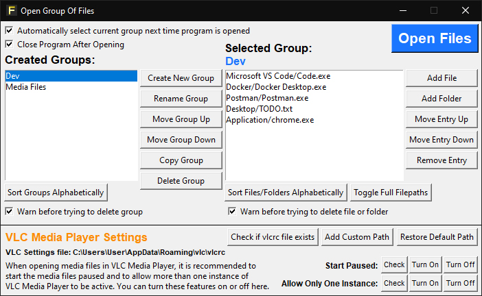

# Open File Groups
**Open File Groups**, or **File Opener**, is a desktop GUI application made for Windows that allows the user to save a group of specific files or folders, and then open them simultaneously.

The application was made with Python and Tkinter, and requires Python to run.

## Features

- Save a group of files or folders to be simultaneously opened
- Add or remove a file or folder from a group at any time
- Create and name multiple groups
- Copy existing groups
- Change VLC Media Player settings to allow multiple instances and start media files paused

## How To Use

1. Click on **'Create New Group'** and name your group
2. Click on **'Add File'** or **'Add Folder'** to add a file or folder to the list of items to be opened
3. Click on **'Open Files'** to open all files and folders in the selected group

## VLC Media Player Settings

This application also allows you to modify two specific VLC Media Player settings:

- *'Allow Only One Instance'* must be turned off if you wish to open multiple media files in VLC at once.
- *'Start Paused'* will start every media file paused when they're opened, if it's turned on.

Click on the **'Check'** button next to the setting to see what your current setting is. Click on **'Turn On'** or **'Turn Off'** next to the setting to turn the setting on or off.

By default, the VLC Media Player settings is located in *'C:\Users\\%USER%\AppData\Roaming\vlc\vlcrc'*. If yours is not located there, you can manually select the settings file by clicking the **'Add Custom Path'** button.

## Saved Groups and Configuration

Saved groups and user configuration is stored in a *'saved_groups.json'* file that gets automatically created in the same directory as the *'file_opener.py'* file when it's run for the first time.